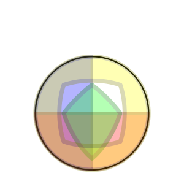

# Face.js


Renders an interactive ball-shaped face on the page.

This is a modern HTML5 remake of a project I made a long time ago in
Flash. The faces come from the old project, but the rendering has been
re-written from scratch for better consistency and more supported
geometries.

## Running Locally

```sh
npm install
npm start
```

## CLI

As well as running in a browser, the face renderer can be invoked from
the commandline:

```shell
# See documentation:
./bin/face-svg.js --help

# Example call:
./bin/face-svg.js --padding=10 --skin=Halloween > myFile.svg
````

---


